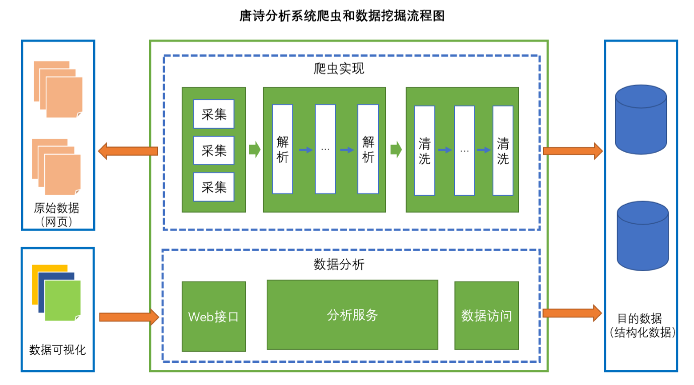

##项目名称
xiaotangpoetry

##项目描述
这是一次有趣的历险记，去探索唐诗的海洋——通过java来分析唐诗，
统计诗人的创作数量以及唐诗中出现频率较多的词云生成图表，通过程序来分析唐诗

##涉及技术
+ Stream流式处理和文本分词和解析（ansj)
+ 多线程及网页解析工具（htmlunit）
+ 数据库和JDBC编程
+ 数据可视化（HTML/CSS/JavaScript , echarts , jQuery）
+ Sparkjava嵌入式Web容器（轻量级容器）
+ DIY(Do It Yourself)构建对象管理工厂
##实现功能
+
+
+

##具体实现

+ 采集
+ 解析
+ 清洗
+ web接口

#项目效果
+ 
+
+

#扩展点
+ 